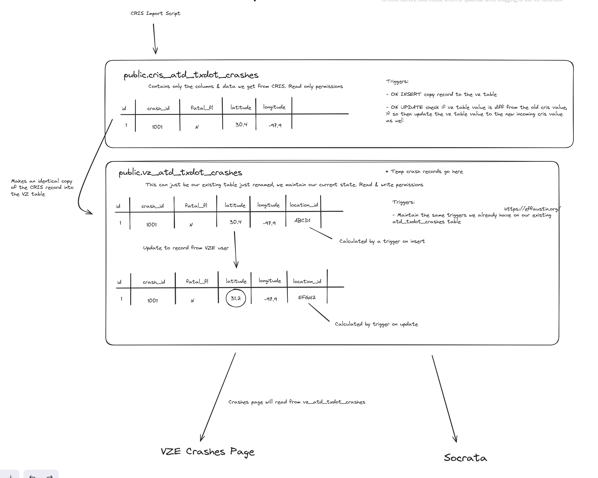
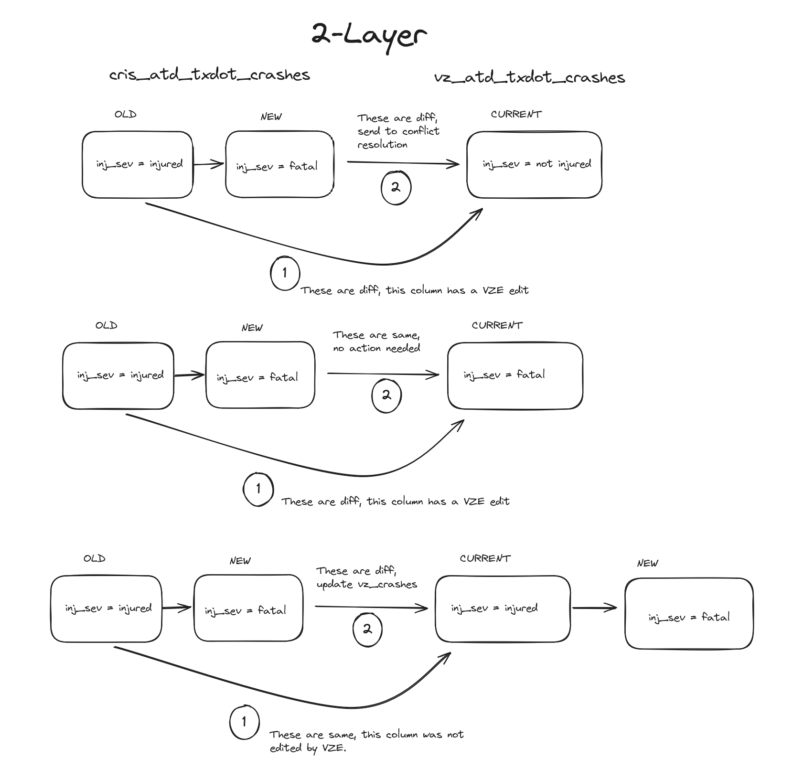

# VZ Two Layer Model Prototype



- CRIS users will insert and update into the tables that are prefixed with `cris_`
- Inserts to the `cris_` tables will trigger copying the record into their respective `crashes` or `units` table
- VZ users will make edits to the `crashes` and `units` tables
- The final "source of truth" are the `crashes` and `units` tables
- Columns that are prefixed with `vz_` were created by VZ and are not columns we receive from CRIS

## Database

- Start the database

```bash
docker compose up -d db
```

- connect on localhost on 5432
- username: `vz`
- password: `vz`
- database: `visionzero`
- it trusts all connections, so the password is optional-ish

## Adminer (DB UI)

- Fire up the Adminer to inspect DB contents via a web UI

```bash
docker compose up -d adminer
```

- connect with a browser on 8080
- use the DB credentials

## Testing

### Building up the database

- First you are going to copy the contents of the `build_tables.sql` file and execute these SQL commands within your DB tool. This will create all necessary tables, functions, and triggers.

### Importing seed data

- Import the crash, units, and locations seed data into their respective tables. Do it in the following order:

- `locations.csv` into `public.locations`
- `crashes.csv` into `public.cris_crashes`
- `units.csv` into `public.cris_units`

  - Delete the first column of the 'units.csv' `unit_id` before importing, the way I wrote my table the `unit_id` is a serial int that the DB takes care of. If you don't delete the first column there will be errors later.

- You should notice that the records you inserted into `public.cris_crashes` and `public.cris_units` were also copied into `public.crashes` and `public.units`, respectively.

### Test cases

- Go through each one of the following sql commands and take your time to execute them and analyze the results.

1. CRIS user creates a crash record with two unit records

```sql
INSERT INTO public.cris_crashes(crash_id, latitude, longitude, primary_address, road_type_id) values (2000000, 30.48501694, -97.72865645, '1234 hello world ave', 3);
INSERT INTO public.cris_units(crash_id, unit_type_id) values (2000000, 3);
INSERT INTO public.cris_units(crash_id, unit_type_id) values (2000000, 5);
```

2. VZ user changes a crash’s Location ID by updating the crash lat/lon

```sql
create or replace procedure vz_update_latlon (id integer, lat double precision, long double precision) language plpgsql as
$$
declare old_location text;
declare new_location text;
begin
    raise notice 'VZ user updating lat/long of crash_id %', id;
    SELECT INTO old_location vz_location_id FROM public.crashes WHERE crash_id = id;
    UPDATE public.crashes SET latitude = lat, longitude = long WHERE crash_id = id;
    SELECT INTO new_location vz_location_id FROM public.crashes WHERE crash_id = id;
    raise notice 'Location updated from % to %', old_location, new_location;
end;
$$;

CALL vz_update_latlon(1, 30.434043190707328, -97.70021501519273);
CALL vz_update_latlon(1, 30.31860473, -97.62621625);
```

3. VZ user edits a unit type

```sql
create or replace procedure vz_update_unit_type (id integer, unit_type integer) language plpgsql as
$$
declare old_unit_type text;
declare new_unit_type text;
begin
    raise notice 'VZ user updating unit type of unit id %', id;
    SELECT INTO old_unit_type unit_type_id FROM public.units WHERE unit_id = id;
    UPDATE public.units SET unit_type_id = unit_type WHERE unit_id = id;
    SELECT INTO new_unit_type unit_type_id FROM public.units WHERE unit_id = id;
    raise notice 'Unit type updated from % to %', old_unit_type, new_unit_type;
end;
$$;

CALL vz_update_unit_type(1, 6);
```

4. CRIS user updates the crash lat/lon, and road type

```sql
create or replace procedure cris_update_latlon (id integer, lat double precision, long double precision, road_type integer) language plpgsql as
$$
begin
    raise notice 'CRIS user updating lat/long of crash_id % to %,% and road type to %', id, lat, long, road_type;
    UPDATE public.cris_crashes SET latitude = lat, longitude = long, road_type_id = road_type WHERE crash_id = 2;
end;
$$;

CALL cris_update_latlon(2, 30.47371683, -97.6891157, 4);
```

5. CRIS user updates a unit type

```sql
create or replace procedure cris_update_unit (id integer, unit_type integer) language plpgsql as
$$
begin
    raise notice 'CRIS user updating unit type of unit_id % to %', id, unit_type;
    UPDATE public.cris_units set unit_type_id = unit_type WHERE unit_id = id;
end;
$$;

CALL cris_update_unit(2, 1);
```

6. VZ user adds a custom lookup value and uses it. VZ custom lookup values will start at something like 11111 so we can be sure they will never overlap with cris lkp values.

   - _Another idea is to have a vz_custom column that is a boolean in the lookup table. The pkey for the table is the combo of lkp_id and vz_custom. So custom vz values could also start at 1 but would have true for the vz_custom column and thats how they are differentiated. This method is not demonstrated._

```sql
create or replace procedure vz_custom_lkp (u_id integer, unit_type integer, type_desc text) language plpgsql as
$$
declare old_unit_type_id integer;
declare old_unit_type_desc text;
begin
    SELECT INTO old_unit_type_id unit_type_id from public.units WHERE unit_id = u_id;
    SELECT INTO old_unit_type_desc description from public.unit_type_lkp WHERE id = old_unit_type_id;
    raise notice 'VZ user adding new unit type % with id % to unit_type_lkp table', type_desc, unit_type;
    INSERT INTO public.unit_type_lkp(id, description) values (unit_type, type_desc);
    UPDATE public.units set unit_type_id = unit_type WHERE unit_id = u_id;
    raise notice 'VZ user updated unit type of unit id % from % to %', u_id, old_unit_type_desc, type_desc;
end;
$$;

CALL vz_custom_lkp(2, 11111, 'scooter');
```

7. Create a query that demonstrates the correct source of truth when crashes and units have edits from both CRIS and the VZ user

```sql
--  CRIS user edited this record in step 5
SELECT * FROM public.cris_units WHERE unit_id = 2;
-- VZ user edited this record in step 6
SELECT * FROM public.units WHERE unit_id = 2;

-- CRIS user did not edit this record
SELECT * FROM public.cris_crashes WHERE crash_id = 1;
-- VZ user did edit this record in step 2
SELECT * FROM public.crashes WHERE crash_id = 1;

-- Neither CRIS nor VZ edited these records, they should have the same lat/long and road type
SELECT * FROM public.cris_crashes WHERE crash_id = 50;
SELECT * FROM public.crashes WHERE crash_id = 50;
```

8. Query for a single crash by ID

```sql
SELECT * FROM public.crashes WHERE crash_id = 5;
```

9. Query for a large number of crashes. You can edit this number to increase/decrease it.

```sql
SELECT * FROM public.crashes LIMIT 1000;
```

10. Create a query/view that powers a simplified version of the locations table, for example by calculating total number of units per location (for reference see: locations_with_crash_injury_counts in the DB)

```sql
CREATE OR REPLACE VIEW public.locations_with_crash_unit_counts AS
WITH crashes AS (
  SELECT crashes.vz_location_id,
      count(DISTINCT crashes.crash_id) AS crash_count,
      count(units.unit_id) AS unit_count
      FROM crashes
        LEFT JOIN units ON units.crash_id = crashes.crash_id
    WHERE true AND crashes.vz_location_id IS NOT NULL
    GROUP BY crashes.vz_location_id
)
  SELECT locations.description,
  locations.location_id,
  COALESCE(crashes.crash_count, 0) AS crash_count,
  COALESCE(crashes.unit_count) AS unit_count
   FROM locations
     LEFT JOIN crashes ON locations.location_id::text = crashes.vz_location_id::text
  WHERE locations.location_group = 1;

SELECT *
FROM "locations_with_crash_unit_counts"
ORDER BY "crash_count" DESC
LIMIT 100
```

11. Create a test case, or simply write out the steps that would be involved if we wanted to add a new editable column to crashes

We would prefix the column with `vz_` and add it only to the `public.crashes` table

```sql
ALTER TABLE public.crashes ADD COLUMN vz_law_enforcement_num integer;
UPDATE public.crashes SET vz_law_enforcement_num = 1 WHERE crash_id = 1;
SELECT * FROM public.crashes WHERE crash_id = 1;
```

12. [Optional] Create a test case or simply describe the mechanism to support a conflict management system as described in the functional requirements.

Here are some commands to just test the functionality of CRIS updating a value that doesn't yet have any VZ edits, and then updating a value that does have VZ edits.

```sql
-- Demonstrating that values in the crashes table without VZ edits should get updates from CRIS
SELECT road_type_id, primary_address from public.cris_crashes WHERE crash_id = 20;
SELECT road_type_id, primary_address from public.crashes WHERE crash_id = 20;
UPDATE public.cris_crashes SET road_type_id = 1, primary_address = 'testing' WHERE crash_id = 20;
SELECT road_type_id, primary_address from public.cris_crashes WHERE crash_id = 20;
SELECT road_type_id, primary_address from public.crashes WHERE crash_id = 20;

-- Demonstrating that values in the units table without VZ edits should get updates from CRIS
SELECT unit_type_id from public.cris_units WHERE unit_id = 10;
SELECT unit_type_id from public.units WHERE crash_id = 10;
UPDATE public.cris_units SET unit_type_id = 1 WHERE unit_id = 10;
SELECT unit_type_id from public.cris_units WHERE unit_id = 10;
SELECT unit_type_id from public.units WHERE crash_id = 10;

-- Here we are gonna have a VZ user update the road type of the crash
UPDATE public.crashes SET road_type_id = 4 WHERE crash_id = 20;
-- Then CRIS updates their record
UPDATE public.cris_crashes SET road_type_id = 2 WHERE crash_id = 20;
SELECT road_type_id from public.cris_crashes WHERE crash_id = 20;
-- The CRIS update shouldn't have affected the crashes table and it should instead retain the VZ edit
SELECT road_type_id from public.crashes WHERE crash_id = 20;

-- Here we are gonna have a VZ user update the unit type of a unit
UPDATE public.units SET unit_type_id = 3 WHERE unit_id = 10;
-- Then CRIS updates their record
UPDATE public.cris_units SET unit_type_id = 5 WHERE unit_id = 10;
SELECT unit_type_id from public.cris_units WHERE unit_id = 10;
-- The CRIS update shouldn't have affected the units table and it should instead retain the VZ edit
SELECT unit_type_id from public.units WHERE unit_id = 10;
```


